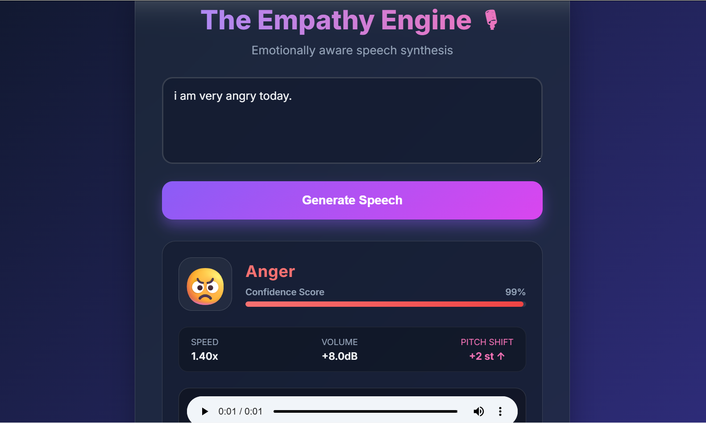
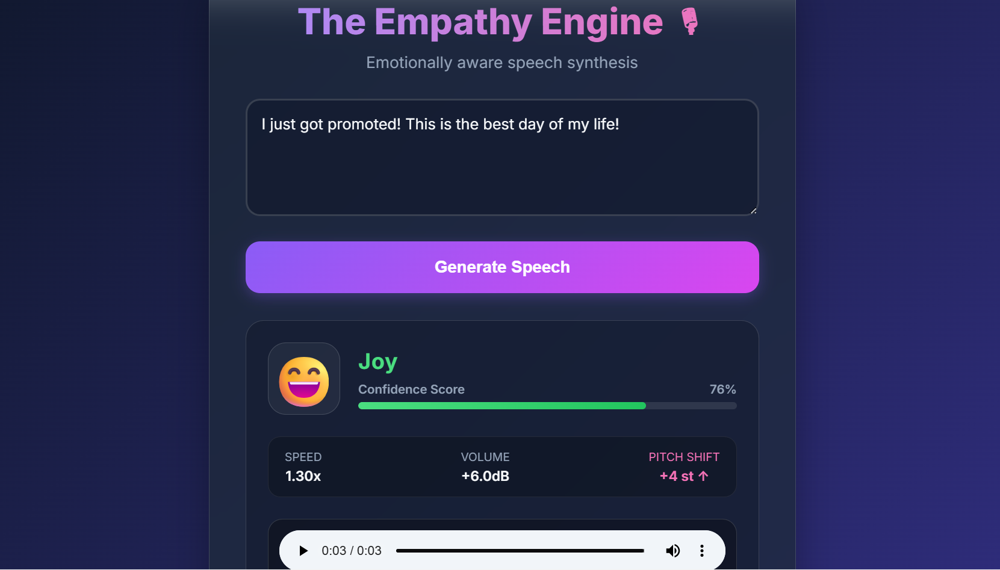
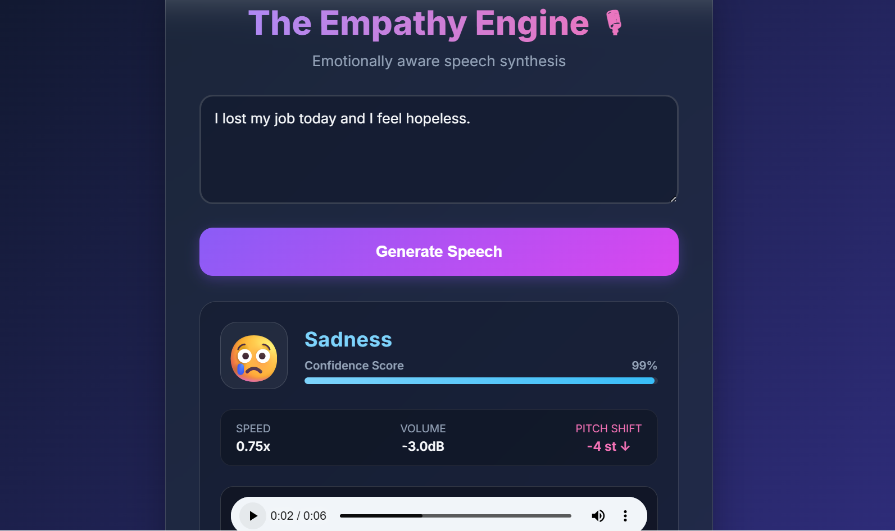

# The Empathy Engine 🎙

Emotionally aware speech synthesis using AI

## ✨ Features

- 7-emotion detection using Hugging Face transformers
- Dynamic voice modulation (Speed + Volume + Pitch)
- SSML-style sentence pausing
- Intensity scaling using confidence score
- Modern web UI with Flask
- Embedded audio player

## 💻 Tech Stack

- Python 3.x
- Flask
- Hugging Face Transformers
- gTTS (Google Text-to-Speech)
- pydub
- scipy + numpy

## 🛠️ Setup Instructions

1. **Clone the repository:**
   ```bash
   git clone https://github.com/VinodRathod1/The-Empathy-Engine.git
   ```

2. **Navigate into the project:**
   ```bash
   cd The-Empathy-Engine
   ```

3. **Create a virtual environment:**
   ```bash
   python -m venv venv
   ```

4. **Activate the environment:**
   - **Windows:** `venv\Scripts\activate`
   - **Mac/Linux:** `source venv/bin/activate`

5. **Install Requirements:**
   ```bash
   pip install -r requirements.txt
   ```

6. **Run the App:**
   ```bash
   python app.py
   ```
   Open your browser at `http://localhost:5000`

## 🎭 Emotion to Voice Mapping

| Emotion  | Speed | Volume | Pitch | Pause | Emoji |
|----------|-------|--------|-------|-------|-------|
| Joy      | 1.3x  | +6dB   | +4st  | 150ms | 😄    |
| Anger    | 1.4x  | +8dB   | +2st  | 80ms  | 😠    |
| Sadness  | 0.75x | -3dB   | -4st  | 400ms | 😢    |
| Fear     | 1.2x  | -2dB   | +1st  | 100ms | 😨    |
| Surprise | 1.35x | +5dB   | +5st  | 120ms | 😲    |
| Disgust  | 0.85x | 0dB    | -2st  | 250ms | 🤢    |
| Neutral  | 1.0x  | 0dB    | 0st   | 200ms | 😐    |

## 🎨 Design Choices

- **Why Hugging Face over VADER:** Hugging Face models (like DistilRoBERTa) are context-aware and specifically trained on 7 distinct emotions, providing far more granular parsing than basic VADER positive/neutral/negative sentiment bounds.
- **Why gTTS + pydub:** This combination is lightweight, completely free, and doesn't require any API keys. Pydub enables raw offline array shifting for Pitch mapped changes without needing expensive server API interactions.
- **Intensity Scaling:** Voice parameters are actively scaled against the Neural Network's `confidence_score`. This ensures the AI doesn't overreact on weak emotional signals but applies maximum modulation on high-confidence prompts.
- **SSML-style Pauses:** Inserting deterministic silences mapped explicitly to semantic punctuation (.!?) dramatically improves the natural feel of the speech, making joyful deliveries punchy but sad deliveries slow, reflective, and spaced out.

## 📸 Screenshots

### Angry Output


### Joy Output


### Sad Output


## 📄 License
MIT
